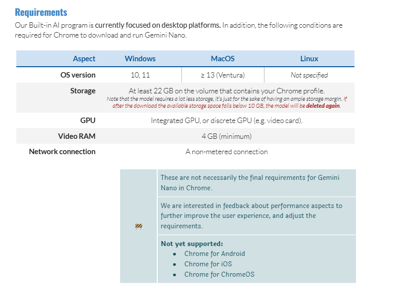

# Gmail Phish Guardian AI 

GmailPhishGuardian AI is a Chrome extension that leverages AI to analyze your Gmail emails for potential phishing attempts. Stay protected by receiving real-time phishing scores and insights directly within your inbox.

**The main reason why I think this is innovative** is because it is an extension that is designed to work with built-in-AI from Google, making it more private and secure since **confidential information is not sent to external servers** and provides an accurate analysis of the email since it analyzes the email content itself and not just the sender or links. **The strength of this extension** is that it analyzes all different aspects of the email, including the sender's email address, subject, body, timestamps, and links, using the most known phishing detection principles.

## Table of Contents

- [Features](#features)
- [Demo](#demo)
- [Installation](#installation)
- [Usage](#usage)
- [License](#license)

## Features

- **Real-Time Analysis**: Automatically analyzes current viewing email in Gmail.
- **Phishing Score Calculation**: Assigns a phishing likelihood score from 0 to 100.
- **Phishing Analysis**: Provides a detailed explanation of the score/analysis.
- **AI-Powered Detection**: Utilizes Google's built-in AI language model with Prompt API to detect phishing indicators.
- **User-Friendly Interface**: Provides a popup with detailed information and actionable buttons.
- **Dark Mode Support**: Toggle between light and dark themes for better visibility.
- **Safe Reporting**: Quickly report phishing emails to Google.

## Demo

## Installation

1. Clone the repository: `git clone https://github.com/yourusername/gmail-phish-guardian.git`
2. Open Chrome and navigate to `chrome://extensions/`
3. Enable "Developer mode" if it's not already enabled.
4. Click on "Load unpacked" and select the cloned repository folder.
5. The extension should now be installed and active.
6. Follow the instructions below from official Google documentation to install built-in-AI and make sure the extension will work correctly.

### Requirements
To try it out, you need to:
* be on Mac or Windows
* **Very important**: Make sure you have the required disk space.
* be on Chrome [dev](https://www.google.com/chrome/dev/) / [canary](https://www.google.com/chrome/canary/) (version >= 127)
* enable `chrome://flags/#optimization-guide-on-device-model` (set to **Enabled BypassPerfRequirement**)
* enable `chrome://flags/#prompt-api-for-gemini-nano` (set to **Enabled**)
* re-launch Chrome and revisit page
* Inspect the page and go to the console tab and type `(await ai.languageModel.capabilities()).available;`
    - If it returns `readily` then the model was installed correctly.
    - If it returns `after-download` is either still downloading or the model is not downloading. Go to [Debug `after-download`](#debug-after-download)
    - If it returns `no` then the model is not installed.
* Debug `after-download`/Check for the current version, try `chrome://components` and look for **Optimization Guide On Device Model**
  * this should have a version which is not `0.0.0.0`. If it is, then the model is not downloading or currently downloading. You can try to click on the update button but don't click too many times.
  * eventually if still not working as of suggestion from the documentation wait a few minutes with the browser open to wait for the  this will have the right value (after downloading the model), then you'll need to relaunch chrome and try again

For any other questions please refer to the Google official documentation on the gemini on device API: https://docs.google.com/document/d/1VG8HIyz361zGduWgNG7R_R8Xkv0OOJ8b5C9QKeCjU0c/edit?tab=t.0

## Usage

1. Open Gmail in Chrome
    - Log in to your Gmail account using Google Chrome.
2. Interact with Emails
    - Open any email conversation.
    - The extension will automatically analyze the email and calculate a phishing score.
3. View Phishing Score
    - Click on the GmailPhishGuardian AI extension icon next to the address bar.
    - The popup will display the email's subject and phishing score.
4. View Email Details and Phishing Analysis
    - Click on Show Email Details to expand and view sender information, timestamp, and a snippet of the email body.
    - Click on Show Phishing Analysis to view the AI's analysis of the email.
5. Toggle Theme
    - Use the theme toggle button in the top-left corner of the popup to switch between light and dark modes.
6. Report Phishing
    - If you suspect an email is phishing, click on Report Phishing to notify Google and help protect others.

## Extension Permissions

The extension requires the following permissions:
- Scripting: To inject scripts into Gmail for data extraction.
- Storage: To store settings and temporary data.
- Tabs: To access the current tab's URL and manage communication between scripts.
- Host Permission for https://mail.google.com/*: To interact with Gmail's web pages.

## How it works

#### Email Data Extraction
The extension uses a content script (content.js) to extract email details such as:
- Sender email address
- Subject line
- Timestamp
- Email body content

#### Phishing Score Calculation
- The extracted data is then sent to the background script (background.js).
- Uses phishing.js to analyze the email with a well defined prompt to the built-in-model.
- The AI model assesses various phishing indicators like urgency tactics, suspicious links, and sender legitimacy.
- Then provides a phishing score from 0 to 100, in a specific defined format and a detailed explanation of the score/analysis.

#### Popup Interface
- The popup interface (popup.html and popup.js) displays the phishing score and email details.
- Provides options to report phishing and learn more about the extension.

## License
This project is licensed under the Apache 2.0 License. See the [LICENSE](/readme_assets/LICENSE) file for details.

